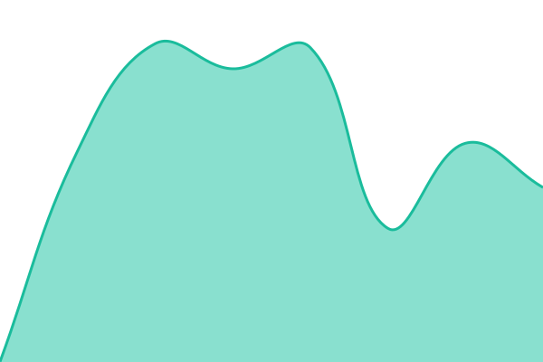
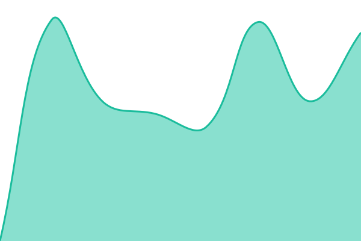
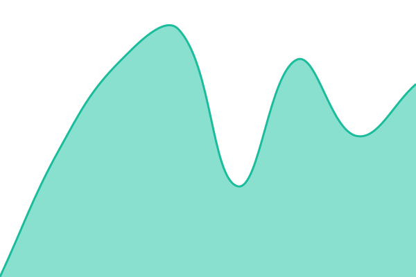
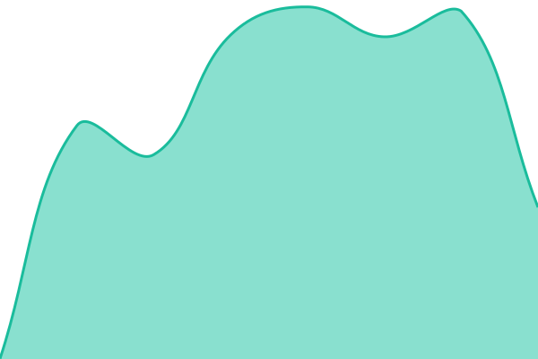
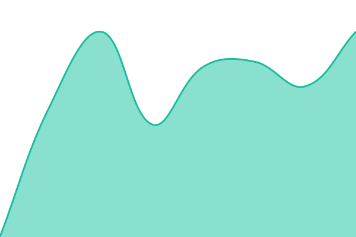
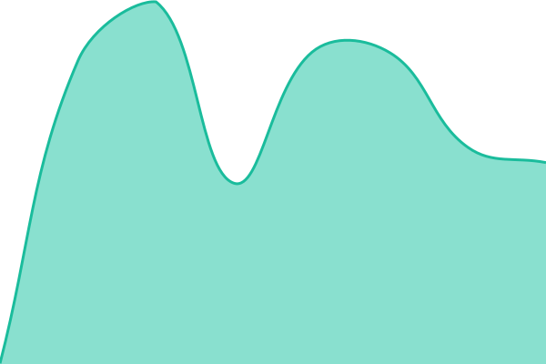
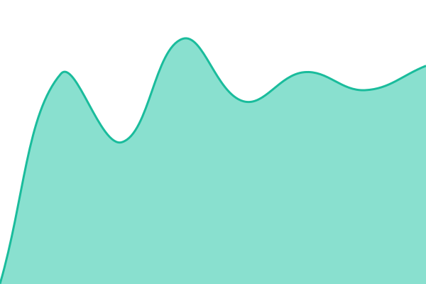

# [📈 Live Status](https://status.drand.ch): <!--live status--> **🟩 All systems operational**

This repository contains the open-source uptime monitor and status page for [cryptohslu](https://status.drand.ch), powered by [Upptime](https://github.com/upptime/upptime).

With [Upptime](https://upptime.js.org), you can get your own unlimited and free uptime monitor and status page, powered entirely by a GitHub repository. We use [Issues](https://github.com/cryptohslu/statuspage/issues) as incident reports, [Actions](https://github.com/cryptohslu/statuspage/actions) as uptime monitors, and [Pages](https://status.drand.ch) for the status page.

<!--start: status pages-->
<!-- This summary is generated by Upptime (https://github.com/upptime/upptime) -->
<!-- Do not edit this manually, your changes will be overwritten -->
<!-- prettier-ignore -->
| URL | Status | History | Response Time | Uptime |
| --- | ------ | ------- | ------------- | ------ |
|  [reproducible.crypto-lab.ch](https://reproducible.crypto-lab.ch/) | 🟩 Up | [reproducible-crypto-lab-ch.yml](https://github.com/cryptohslu/statuspage/commits/HEAD/history/reproducible-crypto-lab-ch.yml) | 

 739ms
     
 | 

<a href="https://status.drand.ch/history/reproducible-crypto-lab-ch">100.00%</a>
    

|  [HSLU drand relay](https://drand.crypto-lab.ch/v2/beacons/quicknet/info) | 🟩 Up | [hslu-drand-relay.yml](https://github.com/cryptohslu/statuspage/commits/HEAD/history/hslu-drand-relay.yml) | 

 823ms
     
 | 

<a href="https://status.drand.ch/history/hslu-drand-relay">100.00%</a>
    

|  [PQC info website](https://pqc.crypto-lab.ch) | 🟩 Up | [pqc-info-website.yml](https://github.com/cryptohslu/statuspage/commits/HEAD/history/pqc-info-website.yml) | 

 793ms
     
 | 

<a href="https://status.drand.ch/history/pqc-info-website">100.00%</a>
    

|  [PQC Digital Signatures](https://pqc.crypto-lab.ch/sig-charts/) | 🟩 Up | [pqc-digital-signatures.yml](https://github.com/cryptohslu/statuspage/commits/HEAD/history/pqc-digital-signatures.yml) | 

 634ms
     
 | 

<a href="https://status.drand.ch/history/pqc-digital-signatures">100.00%</a>
    

|  [PQC TLS](https://pqc.crypto-lab.ch/tls-charts/) | 🟩 Up | [pqc-tls.yml](https://github.com/cryptohslu/statuspage/commits/HEAD/history/pqc-tls.yml) | 

 598ms
     
 | 

<a href="https://status.drand.ch/history/pqc-tls">100.00%</a>
    

|  [PQC Matrix server](https://matrix.crypto-lab.ch) | 🟩 Up | [pqc-matrix-server.yml](https://github.com/cryptohslu/statuspage/commits/HEAD/history/pqc-matrix-server.yml) | 

 698ms
     
 | 

<a href="https://status.drand.ch/history/pqc-matrix-server">100.00%</a>
    

|  [randextract.crypto-lab.ch](https://randextract.crypto-lab.ch/) | 🟩 Up | [randextract-crypto-lab-ch.yml](https://github.com/cryptohslu/statuspage/commits/HEAD/history/randextract-crypto-lab-ch.yml) | 

 727ms
     
 | 

<a href="https://status.drand.ch/history/randextract-crypto-lab-ch">100.00%</a>
    

|  QRNG | 🟩 Up | [qrng.yml](https://github.com/cryptohslu/statuspage/commits/HEAD/history/qrng.yml) | 

 443ms
     
 | 

<a href="https://status.drand.ch/history/qrng">100.00%</a>
    

|  [dice1.drand.ch](https://dice1.drand.ch/) | 🟩 Up | [dice1-drand-ch.yml](https://github.com/cryptohslu/statuspage/commits/HEAD/history/dice1-drand-ch.yml) | 

 447ms
     
 | 

<a href="https://status.drand.ch/history/dice1-drand-ch">100.00%</a>
    

|  [dice2.drand.ch](https://dice2.drand.ch/) | 🟩 Up | [dice2-drand-ch.yml](https://github.com/cryptohslu/statuspage/commits/HEAD/history/dice2-drand-ch.yml) | 

 472ms
     
 | 

<a href="https://status.drand.ch/history/dice2-drand-ch">100.00%</a>
    

|  [dice3.drand.ch](https://dice3.drand.ch/) | 🟩 Up | [dice3-drand-ch.yml](https://github.com/cryptohslu/statuspage/commits/HEAD/history/dice3-drand-ch.yml) | 

 448ms
     
 | 

<a href="https://status.drand.ch/history/dice3-drand-ch">100.00%</a>
    

|  [TURN server](https://turn.crypto-lab.ch/health) | 🟩 Up | [turn-server.yml](https://github.com/cryptohslu/statuspage/commits/HEAD/history/turn-server.yml) | 

 701ms
     
 | 

<a href="https://status.drand.ch/history/turn-server">100.00%</a>
    

|  [hslu.ch/en/acs](https://www.hslu.ch/en/acs) | 🟩 Up | [hslu-ch-en-acs.yml](https://github.com/cryptohslu/statuspage/commits/HEAD/history/hslu-ch-en-acs.yml) | 

 6148ms
     
 | 

<a href="https://status.drand.ch/history/hslu-ch-en-acs">85.99%</a>
    

<!--end: status pages-->

[**Visit our status website →**](https://status.drand.ch)

## 📄 License

- Powered by: [Upptime](https://github.com/upptime/upptime)
- Code: [MIT](./LICENSE) © [Anand Chowdhary](https://anandchowdhary.com), supported by [Pabio](https://pabio.com)
- Data in the `./history` directory: [Open Database License](https://opendatacommons.org/licenses/odbl/1-0/)
